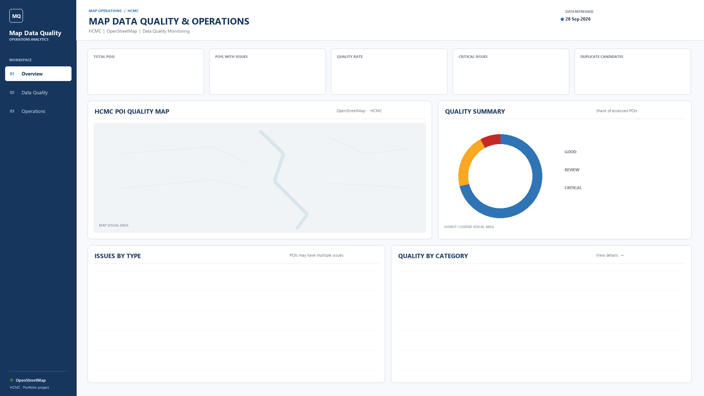
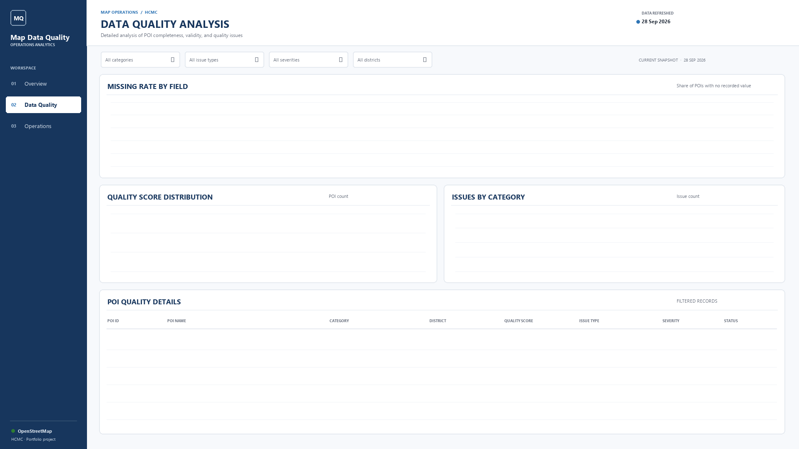
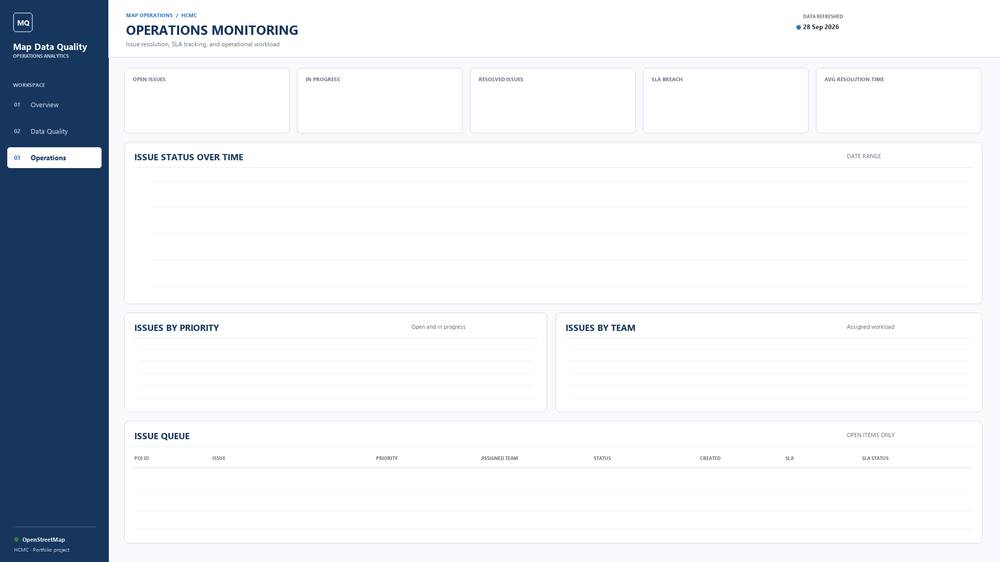

# Map Data Quality & Operations Analytics

A data quality and map operations analytics project built around Ho Chi Minh City points of interest (POIs) from OpenStreetMap. The project extracts POIs, assesses data quality, standardizes categories and location labels, and prepares data for PostgreSQL and Power BI.

> Independent OpenStreetMap portfolio project. It is not affiliated with Grab or any other map provider.

## Power BI Dashboard Layouts

The following 16:9 PNGs are page-background templates for a three-page Power BI report. They provide the navigation, titles, and visual placement areas; Power BI visuals should be layered over them to display live data.

### 01 · Overview



### 02 · Data Quality Analysis



### 03 · Operations Monitoring



To apply a background in Power BI Desktop, set the report page to 16:9, choose the matching PNG under **Format page → Canvas background/Page background**, set **Image fit** to **Fit** and transparency to **0%**, then layer native visuals over the empty panels. Add transparent **Blank** buttons over the sidebar labels and configure **Action → Page navigation** for each destination.

## Data Pipeline

Run the scripts from the project root in this order:

```text
OSM GeoPackage
  -> src/data_extraction.py
  -> src/quality_assessment.py
  -> src/duplicate_detection.py
  -> src/poi_enrichment.py
  -> src/powerbi_export.py
```

The scripts produce intermediate Parquet files and CSV exports under `data/processed/`. `powerbi_export.py` prepares CSVs for Power BI and PostgreSQL; it does not load data into PostgreSQL automatically.

## Run Locally

1. Use Python 3.10 or later.
2. Install the libraries used by the pipeline:

   ```powershell
   python -m pip install pandas geopandas pyarrow
   ```

3. Put the source GeoPackage at `data/raw/hcmc.osm.gpkg`.
4. Run the pipeline from the repository root:

   ```powershell
   python src/data_extraction.py
   python src/quality_assessment.py
   python src/duplicate_detection.py
   python src/poi_enrichment.py
   python src/powerbi_export.py
   ```

The raw GeoPackage is intentionally excluded from Git because it is approximately 93 MB. Obtain the source data separately and place it at the path above.

## PostgreSQL and Power BI

- Create PostgreSQL tables for `poi`, `poi_quality`, `poi_issue`, `operation_task`, and `poi_duplicate_candidate`, matching the CSV column names and foreign-key IDs.
- Import the generated database-ready CSVs from `data/processed/` into their matching tables, preserving the IDs and foreign-key relationships.
- Connect Power BI Desktop to the PostgreSQL database and build the report from `poi`, `poi_quality`, `poi_issue`, `operation_task`, and `poi_duplicate_candidate`.
- SQL reports for quality and operations are in [`sql/quality_report.sql`](sql/quality_report.sql) and [`sql/operations_dashboard.sql`](sql/operations_dashboard.sql).

## Current Data Limitations

- The current issue export creates `OPEN` issues and `NEW` tasks; resolution timestamps are null until issues are actually resolved.
- `assigned_team` currently uses `data_quality`, so team comparisons are not meaningful yet.
- The duplicate-candidate export is currently empty. Duplicate detection removes duplicate rows but does not yet persist candidate pairs.
- Status-over-time and SLA trends need historical status events or daily snapshots; the current data is a single exported snapshot.
- The PostgreSQL `poi` schema includes name, category, address, coordinates, and phone. Fields such as website, opening hours, district, and ward require extending the database model if they are needed in Power BI.

## Repository Structure

```text
 dashboard/
   powerbi_mockup.html
   powerbi_backgrounds/      Power BI page backgrounds and setup guide
 data/
   raw/                      Source GeoPackage (kept out of Git)
   processed/                Pipeline Parquet files and CSV exports
 sql/                        PostgreSQL schema and report queries
 src/                        Extraction, quality, deduplication, enrichment, export
 requirements.txt             Dependency manifest (currently empty)
```

The dependency manifest is currently empty; the install command above lists the core libraries used by the scripts.
